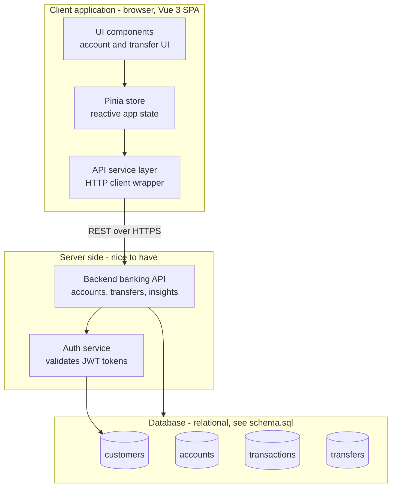
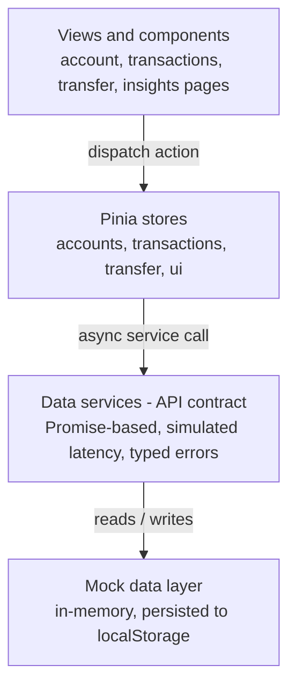
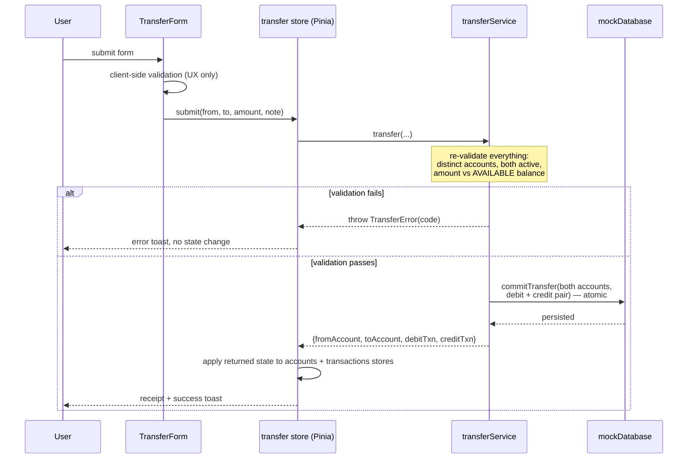

# System architecture

This document covers the required architecture deliverable: components,
communication flow, and how the implemented design maps to the "nice to have"
full-stack target. Diagrams are Mermaid, rendered natively by GitHub/GitLab.

## 1. Target architecture (full-stack reference)

What the system looks like once the nice-to-have backend exists. The demo
implements the client box in full; the server-side boxes are documented by
`schema.sql` and the ADRs.

## 2. Implemented architecture (this repository)

Everything runs in the browser. The **data service layer is the swap point**:
it exposes the exact Promise-based surface an HTTP client would, so replacing
the mock internals with real `fetch` calls touches nothing above it
(see ADR-0001, ADR-0003).

| Layer | Location | Responsibility |
|---|---|---|
| Views/components | `src/views`, `src/components` | Rendering, local UI state, client-side form validation (UX only) |
| Pinia stores | `src/stores` | Shared reactive state, loading/error status, transfer orchestration |
| Data services | `src/services/*Service.js` | The API contract: validation, business rules, typed errors |
| Mock data layer | `src/services/mockDatabase.js`, `src/data/seedData.js` | Storage, atomic commit, persistence |

## 3. Communication flow

### Fetching account and transaction data

1. `App.vue` mounts → `accountsStore.fetchAll()` → `accountService.getCustomer()` + `getAccounts()` in parallel.
2. `TransactionsView` mounts → `transactionsStore.fetch(filters)` → `transactionService.getTransactions(filters)`; filtering (account, category, status, free-text) happens in the service, mirroring server-side query params.
3. Services deep-clone all results, so callers can never mutate stored data by reference — the same isolation JSON-over-HTTP provides.

### Initiating a transfer (pessimistic update — ADR-0003)

Key properties:

- **Fail-closed**: any error throws before any write; a rejected transfer leaves the database byte-identical (unit-tested).
- **Linked ledger entries**: one transfer produces exactly two transactions sharing a `transferGroupId` (normalized as the `transfers` table in `schema.sql`).
- **No optimistic UI**: the stores apply the state the service *returned*, never locally recomputed balances.

### Updating balances and client-side state

After a successful transfer the `transfer` store fans out through explicit
actions: `accountsStore.applyTransferResult()` (both balances),
`transactionsStore.prependTransactions()` (register), `uiStore.pushToast()`
(feedback). Derived values (`totalAvailableBalance`, `transferableAccounts`)
are Pinia getters, so they can never drift from the source data.

## 4. Database schema

See [`schema.sql`](./schema.sql) — MySQL 8 DDL for `customers`, `accounts`,
`transfers`, `transactions`, a derived view for available balance, and the
transfer transaction semantics (`SELECT ... FOR UPDATE`, two balance updates,
two ledger inserts, commit-or-rollback).
